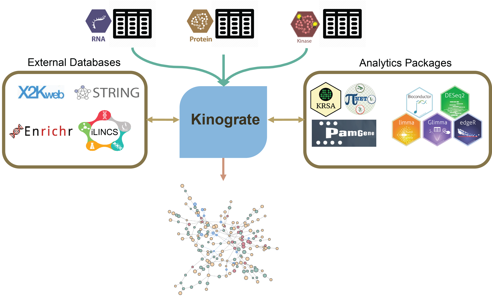
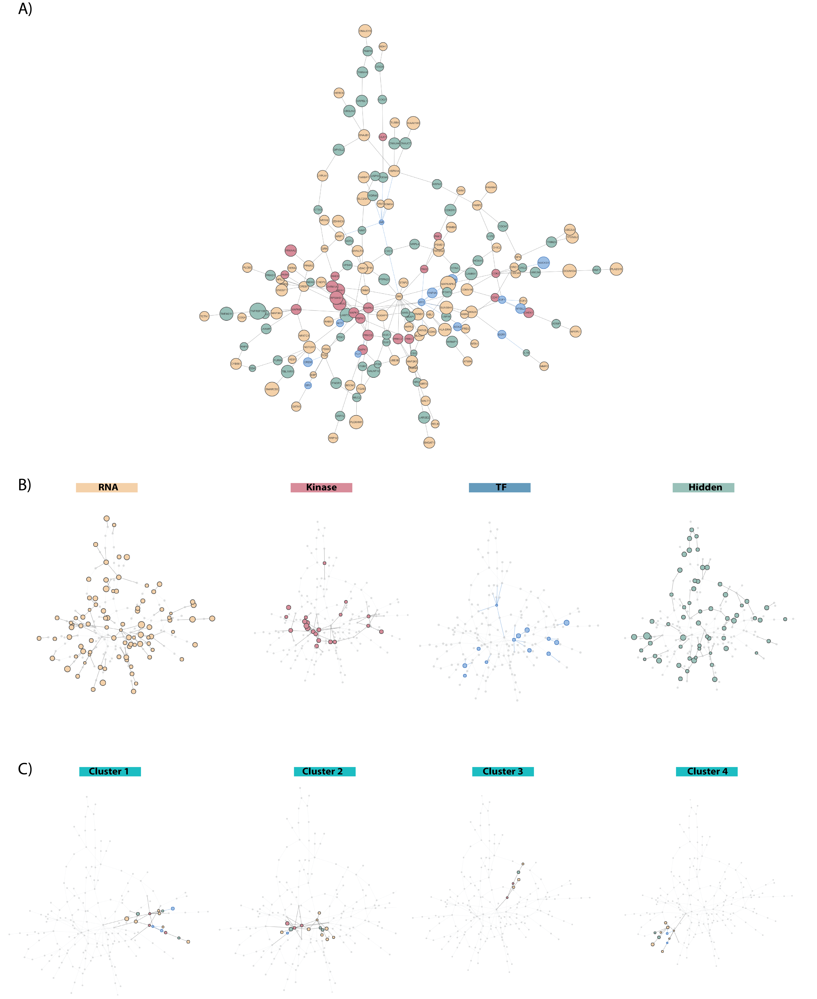

# Kinograte

<!-- badges: start -->
<!-- badges: end -->

An R package for network-based integration of multi-omics datasets.
Kinograte is designed to utilize the [prize-collecting Steiner forest
(PCSF)
algorithm](https://homepage.univie.ac.at/ivana.ljubic/research/pcstp/).
In this case, the goal of the PCSF algorithm is to identify a simplified
sub network representative of a disease or a chemical perturbagen.

## Installation

``` r
# install.packages("devtools")
devtools::install_github("kalganem/Kinograte")
```

## Scope

For many research questions, it is insufficient to only measure
transcript or protein expression levels. As nascent peptides undergo
[post-translational modification
(PTM)](https://www.thermofisher.com/us/en/home/life-science/protein-biology/protein-biology-learning-center/protein-biology-resource-library/pierce-protein-methods/overview-post-translational-modification.html),
they gain diverse biological properties integral to cell signaling
behaviors. Thus, relying exclusively upon gene expression data severely
limits our ability to generate useful scientific insights for complex
biological systems. Given the importance of kinome activity in signal
transduction and its role in many cellular processes like apoptosis and
cell cycle, it becomes clear that characterizing kinome signatures in
conjunction with transcriptional and proteomics signatures is a critical
to understand the pathophysiology of complex diseases and identify novel
therapeutic targets.

The complexity of active kinase networks makes the interpretation of
kinomic datasets challenging. Protein kinase signaling does not work in
a linear fashion (i.e an alteration in kinase activity affects
downstream cascades as well as whole subnetworks of interactions, often
triggering compensatory responses in other parts of the active kinome.
To learn more on that topic read our [kinome review
paper](https://pubmed.ncbi.nlm.nih.gov/34968947/)).

Moreover, signature-based drug repurposing is more promising with the
addition of post-translational profiles. Pairing transcriptional
profiles (such as those found in [LINCS](https://lincsproject.org/))
with active kinome profiles will identify subnetworks that can be used
to better understand biological systems and highlight optimized drug
targets. Kinograte is designed with a focus on kinomics in particular to
integrate multi-omics datasets.

## Workflow



## Output

To visualize the integrated networks, we primally use the [visNetwork R
package](https://datastorm-open.github.io/visNetwork/) for its
interactivity and degree of customization. To cluster protein and
identify community structures within the integrated networks, we utilize
some of the functionality deployed by the [igraph R
package](https://igraph.org/r/). This clustering technique allows for
performing gene/protein set and pathway enrichment analysis within each
cluster of proteins using [Enrichr](https://maayanlab.cloud/Enrichr/)



## Package Website

<https://kalganem.github.io/Kinograte/>

## Contact

For technical issues, please start a new issue on this repo:
[Link](https://github.com/CogDisResLab/KRSA/issues)

For biological interpretation questions please email:
<khaled.alganem@rockets.utoledo.edu>
